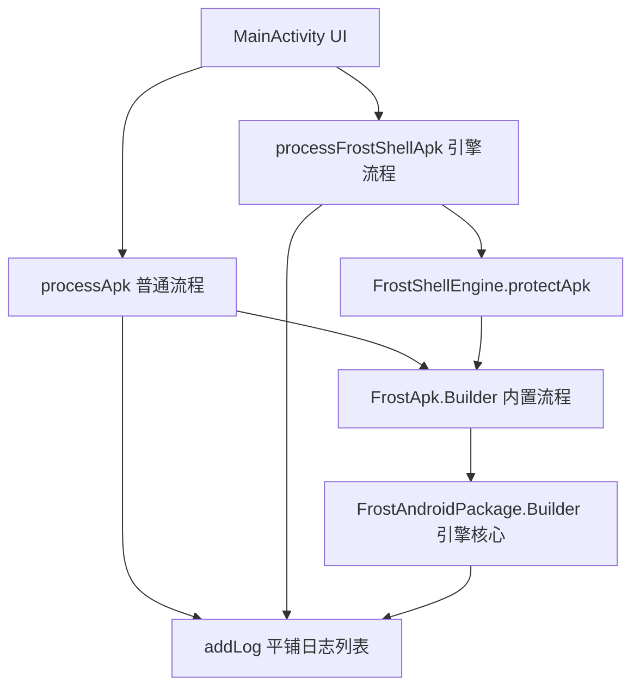
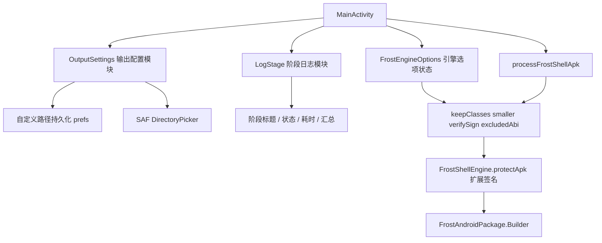

# Feature Design: Customizable I/O and Engine Options

Feature Name: customizable-io-and-engine-options
Updated: 2026-09-01

## Description

为 AndroidHardeningTool 增加三项能力：

1. **输出路径可配置**：支持自定义输出目录（SAF 目录选择器 + 手动文本回退），未自定义时默认输出到所选 APK 所在目录（来源位置），与选择 APK 的途径一致。
2. **运行日志清晰化**：日志面板按阶段分组展示，每阶段显示成功/失败状态与耗时，末尾展示全流程汇总。
3. **FrostShell 高级引擎选项**：在 UI 中暴露 keep-classes（保留部分类）、smaller（瘦身）、verify-sign（运行时验签）、exclude-abi（剔除 ABI）四个官方选项。

技术基线：Kotlin 1.9.20 / Material3 / 单 Activity Compose 应用；FrostShell Kotlin 移植版位于 `app/src/main/java/com/adfxcbnm/frostshell/`。

## Architecture

### 现状（before）

- 两条加固流程（`processApk` 普通流程、`processFrostShellApk` 引擎流程）均硬编码输出目录 `context.getExternalFilesDir(null)/ADFXCBNM/`（MainActivity.kt:1338、MainActivity.kt:1699）。
- 日志 `addLog(message, type)` 平铺追加，无阶段分组，引擎日志直接透传为 INFO（MainActivity.kt:184、FrostShellEngine 调用处）。
- `FrostShellEngine.protectApk(apkPath, outputDir)` 仅传 `filePath/outputPath/sign` 三个 Builder 项，未暴露 `keepClasses/smaller/verifySign/excludedAbi`。



### 目标（after）



## Components and Interfaces

### 1. `OutputSettings`（新增，`com.adfxcbnm.hardeningtool`）

管理输出目录配置，职责单一。

| 成员 | 类型 | 说明 |
|------|------|------|
| `aurantiDir: String` | prefs key `output_dir` | 用户自定义输出目录绝对路径，空表示未自定义 |
| `getCurrentOutputDir(context, apkSourceDir: String?): File` | 函数 | 返回：自定义路径（已校验可写）→ apk 所在目录 → `getExternalFilesDir/ADFXCBNM` 兜底 |
| `resolveApkPath(uri: Uri): String?` | 函数 | 将文件选择器返回的 Uri 解析为源 APK 的文件路径 |
| `selectOutputDir(launcher)` | SAF `OpenDocumentTree` | 用户选择输出目录，`takePersistableUriPermission` 持久化 |
| `isWritable(path: String): Boolean` | 函数 | 检查目标目录可写，失败回退 |

**接口约定：**
- `processApk` / `processFrostShellApk` 调用 `getCurrentOutputDir(context, sourceDir)` 获取输出目录，替换两处硬编码 `File(context.getExternalFilesDir(null), "ADFXCBNM")`。
- 输出成功后 `addLog("产物已保存: <完整路径>", LogType.SUCCESS)`。

### 2. `LogStage`（新增，同包）

阶段化日志模型。

```kotlin
enum class StageStatus { RUNNING, SUCCESS, WARNING, ERROR }

data class StageEntry(
    val index: Int,
    val name: String,
    val status: StageStatus,
    val durationMs: Long
)
```

| 函数 | 说明 |
|------|------|
| `beginStage(name: String)` | 输出阶段标题，记录开始时间，将 `currentStage` 置 RUNNING |
| `endStage(status: StageStatus)` | 输出阶段状态+耗时，追加汇总 |
| `endAll(summary)` | 输出总耗时、阶段数、成功/失败数汇总 |
| `getUiState(): List<LogEntry>` | 把阶段标题/状态/汇总转换成现有 `LogEntry` 渲染 |

**规则：**
- 详细日志开关 `verboseLogs=false` 时，只渲染阶段级条目（标题/状态/耗时/汇总），抑制引擎透传的 INFO 行。
- 失败阶段以 ERROR 样式突出，并附带 `e.message` 摘要（保留现有堆栈行为，折叠在阶段下）。
- `MAX_LOG_ENTRIES=200` 截断策略改为"保留最近完整阶段"：截断时对齐到最近一个阶段边界，避免阶段中途被切。

**决策：不引入独立的新 data class 渲染层**，复用现有 `LogEntry(time, message, type)`（MainActivity.kt:62），阶段信息编码为成对消息（标题行=INFO、状态行=SUCCESS/ERROR/WARNING），避免大改 UI 列表结构，改动集中在 `addLog` 调用点与一个 `StageTracker` 状态。如需更强表达，仅扩展 `LogEntry` 增加可选 `stageGroup: String?` 字段用于分组底色。

### 3. `FrostEngineOptions`（新增 data class，同包）

```kotlin
data class FrostEngineOptions(
    val keepClasses: Boolean = false,
    val smaller: Boolean = false,
    val verifySign: Boolean = false,
    val excludedAbi: List<String>? = null
)
```

- UI 状态 `remember { mutableStateOf(FrostEngineOptions()) }`，持久化到 `adfxcbnm_settings`（key：`frost_keep_classes` / `frost_smaller` / `frost_verify_sign` / `frost_excluded_abi`）。
- 在设置弹窗（SettingsSheet，MainActivity.kt:964 区域）为 FrostShell 新增 4 个 `SettingRow`，其中剔除 ABI 展示所有可选 ABI（`arm64-v8a`、`armeabi-v7a`、`x86`、`x86_64`）复选列表，未勾选的 ABIs 写入 `excludedAbi`。

### 4. `FrostShellEngine.protectApk` 扩展（修改）

新增重载，将引擎选项透传给 Builder：

```kotlin
fun protectApk(apkPath: String, outputDir: File, options: FrostEngineOptions = FrostEngineOptions()): File {
    val builder = FrostApk.Builder()
        .filePath(apkPath)
        .outputPath(outputDir.absolutePath)
        .sign(true)
        .apply {
            if (options.keepClasses) this.keepClasses(true)
            if (options.smaller) this.smaller(true)
            if (options.verifySign) this.verifySign(true)
            if (!options.excludedAbi.isNullOrEmpty()) this.excludedAbi(options.excludedAbi)
        }
    builder.build().protect()
    return findOutputApk(outputDir, apkPath)
}
```

引擎侧无需改动：`FrostAndroidPackage.Builder` 已支持全部字段（FrostAndroidPackage.kt:949-1025），`verifySign` 在 prepare 阶段计算签名 SHA-256（:929-937），`excludedAbi` 在 `copyNativeLibs` 中跳过指定 ABI 的 so（:393-401），`smaller` 控制 Dex/zip 压缩策略（:579-624、:686）。

## Data Models

### 持久化键（`adfxcbnm_settings` SharedPreferences，与现有键共存）

| Key | 类型 | 默认 | Seq |
|-----|------|------|-----|
| `output_dir` | String | ""（未自定义） | 1 |
| `output_dir_saf_uri` | String | "" | 1 |
| `frost_keep_classes` | Boolean | false | 4 |
| `frost_smaller` | Boolean | false | 4 |
| `frost_verify_sign` | Boolean | false | 4 |
| `frost_excluded_abi` | StringSet | 空集（所有 ABI 保留） | 4 |

已存在键保持不变：`verbose_logs` / `timestamped_output` / `auto_verify` / `remember_selection` / `use_frost_engine`。

## Correctness Properties

1. 输出目录解析优先级恒定：自定义可写路径 → 源 APK 所在目录 → 私有 `ADFXCBNM` 兜底；兜底路径行为与旧版一致（不破坏既有产物位置预期）。
2. 无论输出目录如何变化，源 APK 处理链路不变：普通流程流式写临时文件，FrostShell 流程写 cacheDir 输入（MainActivity.kt:1713），随后引擎在目标目录生成产物。
3. 阶段追踪器在流程开始时重置，流程结束（成功或异常）必调用 `endAll`，保证汇总必出现。
4. 引擎选项仅在 FrostShell 流程生效，普通流程忽略；未启用时 `FrostEngineOptions()` 默认实例保持行为逐位兼容旧版。
5. 剔除所有 ABI 的 guard：若 `excludedAbi` 覆盖全部可选 ABI，UI 显示明确警告且拒绝提交（保持至少 1 个 ABI）。

## Error Handling

| 场景 | 处理 |
|------|------|
| 自定义路径无权限/创建失败 | `getCurrentOutputDir` 回退默认，`addLog("指定路径不可写，已回退默认目录: <默认路径>", WARNING)` |
| SAF 选择目录后无持久化权限 | WARNING 提示本次有效；`output_dir_saf_uri` 为空，下次回退文本/默认 |
| 源 APK Uri 无法解析为文件路径（如非 file 方案） | 输出目录回退私有 `ADFXCBNM`，日志提示 |
| 引擎选项 verifySign 而引擎计算 SHA-256 失败 | 引擎已内建保护（FrostAndroidPackage.kt:935 error log），UI 显示 ERROR 阶段 |
| 剔除了某 ABI 后该 ABI 目录不存在于 shell libs | 引擎 `copyNativeLibs` 静默跳过，无副作用 |

## Test Strategy

- 单元测试（JVM，`app/src/test`）：
  - `OutputSettings.getCurrentOutputDir` 三级回退优先级（自定义可写→源目录→兜底）。
  - `LogStage` 阶段 begin/end 产生正确状态与耗时，`endAll` 汇总计数正确。
  - `FrostEngineOptions` 默认实例与旧 `protectApk` 调用等效（Builder 只接收 filePath/outputPath/sign）。
- 构建验证：`./gradlew :app:assembleDebug` 成功；`testDebugUnitTest` 通过。
- 真机/手工冒烟（UI 层无法单元覆盖）：
  1. 文件选择器选 APK → 产物落在源 APK 同目录；设置自定义目录 → 产物落自定义目录；自定义目录删权后回退默认。
  2. 关闭详细日志后运行引擎流程 → 仅显示阶段标题/状态/耗时/汇总。
  3. 引擎流程开启 keepClasses+smaller+verifySign，验证产物生成、日志含签名 SHA-256；剔除 x86/x86_64 后确认产物 size 变化。

## References

- [(File, Humans, Electronics, Software)] - AndroidHardeningTool 源码根目录：`/tmp/opencode/merge/android/AndroidHardeningTool/`
- MainActivity.kt:1338 硬编码输出目录（普通流程）
- MainActivity.kt:1699 硬编码输出目录（引擎流程）
- MainActivity.kt:1713 引擎输入缓存文件
- MainActivity.kt:184 `addLog`、MainActivity.kt:54 `MAX_LOG_ENTRIES`、MainActivity.kt:62 `LogEntry`
- MainActivity.kt:964 `SettingsSheet` 设置弹窗
- FrostAndroidPackage.kt:929-937 verifySign SHA-256、:393-401 excludedAbi、:949-1025 Builder 全字段
- FrostShellEngine.kt:53 `protectApk` 现有签名